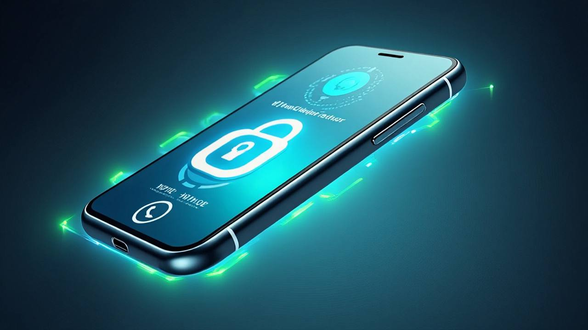

# WhatsApp refuerza la privacidad con @username y PIN anti-spam

**Ciudad Autónoma de Buenos Aires, 1 de julio de 2026.** WhatsApp anunció hoy una actualización doble pensada para blindar la privacidad. Desde esta semana, la app permite configurar un **@username único** para compartir el perfil sin revelar el número de teléfono, y suma un **código PIN obligatorio** para autorizar nuevos contactos y proteger sesiones desde dispositivos no verificados.

### Cómo crear tu @username en 3 pasos (modo minimalista)
1. Abrí **Configuración › Perfil** en la app y tocá *Nombre de usuario*.
2. Escribí un identificador entre 5 y 30 caracteres (letras, números o guion bajo) y confirmá cuando aparezca disponible.
3. Compartí el enlace `https://wa.me/@tusuario` con tu comunidad; no hace falta revelar el número en ningún canal público.

## ¿Qué cambia para las marcas y comunidades?
- **Identidad controlada:** Los perfiles públicos podrán difundirse con un identificador corto, lo que simplifica campañas y activaciones sin exponer números personales del equipo.
- **Capa anti-spam:** El PIN funciona como llave de seguridad. Si alguien intenta iniciar un chat sin invitación, la app solicitará el código antes de entregar los mensajes.
- **Analíticas limpias:** Menos interacciones basura significa métricas más fiables para funnels conversacionales y chatbots.

## Claves técnicas
1. **Formato del nombre de usuario:** entre 5 y 30 caracteres, combina letras, números y guiones bajos. La reserva es por orden de llegada.
2. **Sincronización multi-dispositivo:** el PIN se solicita cuando un nuevo dispositivo intenta clonar una cuenta, reduciendo el secuestro de sesiones.
3. **Compatibilidad con catálogos y bots:** las API Cloud y On-Premise recibirán el campo `username` para identificar chats sin exponer MSISDN.

## Qué sigue
Meta confirmó que en agosto liberará la API para validar @username desde integraciones empresariales. Mientras tanto, recomienda activar el PIN desde Configuración > Privacidad > Código PIN de acceso.

> _"El objetivo es que cada conversación empiece con consentimiento explícito"_, explicó Aline Diniz, directora de producto de WhatsApp, en el evento virtual Craftdigit Connect.

La actualización ya se distribuye de forma gradual en iOS, Android y WhatsApp Web. Se espera que toda la base activa la reciba antes del 15 de julio.